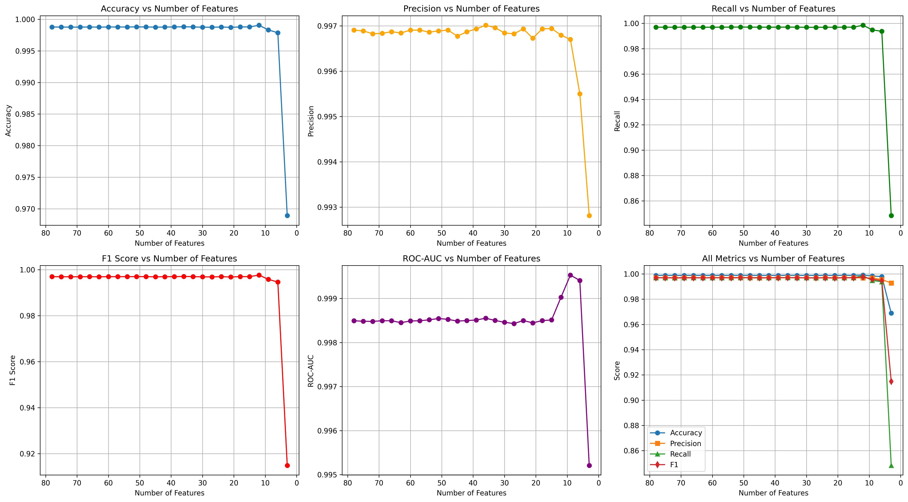
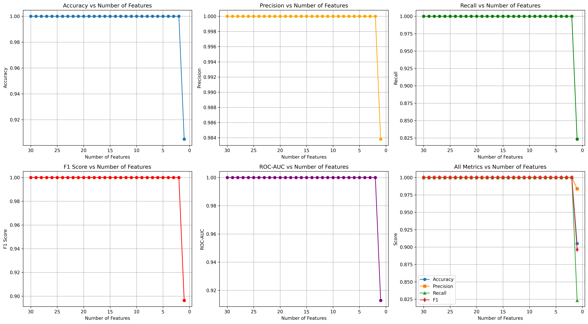
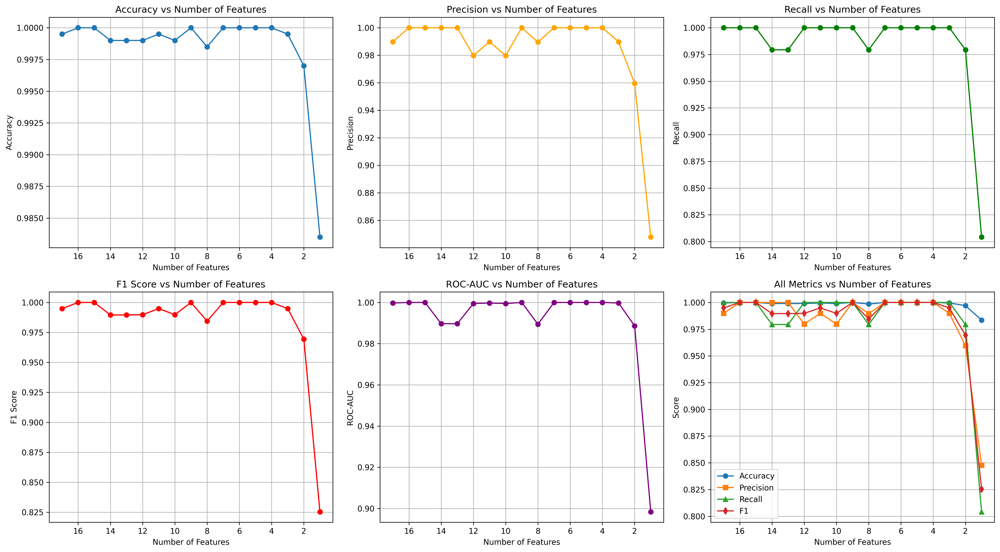

# Decision Tree Experiments - Comprehensive Summary Report

Generated: 2026-01-31 01:23:29

================================================================================

## 1. Main Decision Tree Experiments

### Dataset Information

#### SensorNetGuard IDS

- **Training samples**: 8,000
- **Test samples**: 2,000
- **Features**: 17
- **Training class distribution**: {'0': 7610, '1': 390}
- **Test class distribution**: {'0': 1903, '1': 97}

#### Farm-Flow Binary Classification

- **Training samples**: 561,081
- **Test samples**: 3,545
- **Features**: 26
- **Training class distribution**: {'0': 284880, '1': 276201}
- **Test class distribution**: {'0': 1774, '1': 1771}

#### CIC IDS 2017 Binary Classification

- **Training samples**: 2,264,594
- **Test samples**: 566,149
- **Features**: 70
- **Training class distribution**: {'0': 1818477, '1': 446117}
- **Test class distribution**: {'0': 454620, '1': 111529}

### Tree Properties

| Dataset | Max Depth | Nodes | Leaves |
|---------|-----------|-------|--------|
| SensorNetGuard | 7 | 23 | 12 |
| Farm-Flow | 9 | 41 | 21 |
| CIC IDS 2017 | 43 | 6,371 | 3,186 |

### Test Set Performance Metrics

| Dataset | Accuracy | Precision | Recall | F1 Score | ROC-AUC | Avg Precision |
|---------|----------|-----------|--------|----------|---------|---------------|
| SensorNetGuard | 0.9995 | 0.9898 | 1.0000 | 0.9949 | 0.9997 | 0.9898 |
| Farm-Flow | 1.0000 | 1.0000 | 1.0000 | 1.0000 | 1.0000 | 1.0000 |
| CIC IDS 2017 | 0.9988 | 0.9969 | 0.9970 | 0.9969 | 0.9985 | 0.9951 |

### Decision Tree Visualizations

#### SensorNetGuard


#### Farm-Flow


#### CIC IDS 2017


## 2. Decision Stump Experiments (1-Rule Models)

These experiments test model robustness by using only the top feature.


### SensorNetGuard Decision Stump

- **Top Feature**: Error_Rate
- **Feature Importance**: 0.842579
- **Threshold**: 0.158483

**Performance:**

- Test Accuracy: 0.9900
- Test Precision: 0.9753
- Test Recall: 0.8144
- Test F1: 0.8876
- Test ROC-AUC: 0.9067

**Noise Impact Analysis (Perturbation Study):**


**Performance vs Noise Level:**

| Noise Level (std) | Accuracy | Precision | Recall | F1 Score |
|-------------------|----------|-----------|--------|----------|
| 0.00 | 0.9900 | 0.9753 | 0.8144 | 0.8876 |
| 0.01 | 0.9900 | 0.9639 | 0.8247 | 0.8889 |
| 0.05 | 0.9900 | 0.9639 | 0.8247 | 0.8889 |
| 0.10 | 0.9905 | 0.9643 | 0.8351 | 0.8950 |
| 0.20 | 0.9880 | 0.9294 | 0.8144 | 0.8681 |
| 0.50 | 0.9780 | 0.7573 | 0.8041 | 0.7800 |
| 1.00 | 0.9305 | 0.3871 | 0.7423 | 0.5088 |
| 2.00 | 0.8105 | 0.1643 | 0.7113 | 0.2669 |
| 5.00 | 0.6430 | 0.0870 | 0.6701 | 0.1540 |

**Cross-Validation (5-fold):**

- Mean Accuracy: 0.9920 (±0.0021)
- Mean F1: 0.9131 (±0.0259)

### Farm-Flow Decision Stump

- **Top Feature**: orig_pkts
- **Feature Importance**: 0.854616
- **Threshold**: 0.168970

**Performance:**

- Test Accuracy: 0.9001
- Test Precision: 0.9937
- Test Recall: 0.8052
- Test F1: 0.8896
- Test ROC-AUC: 0.9001

**Noise Impact Analysis (Perturbation Study):**


**Performance vs Noise Level:**

| Noise Level (std) | Accuracy | Precision | Recall | F1 Score |
|-------------------|----------|-----------|--------|----------|
| 0.00 | 0.9001 | 0.9937 | 0.8052 | 0.8896 |
| 0.01 | 0.9001 | 0.9937 | 0.8052 | 0.8896 |
| 0.05 | 0.9001 | 0.9937 | 0.8052 | 0.8896 |
| 0.10 | 0.9001 | 0.9937 | 0.8052 | 0.8896 |
| 0.20 | 0.8841 | 0.9795 | 0.7843 | 0.8711 |
| 0.50 | 0.7704 | 0.8500 | 0.6561 | 0.7406 |
| 1.00 | 0.6804 | 0.7359 | 0.5618 | 0.6372 |
| 2.00 | 0.6051 | 0.6264 | 0.5189 | 0.5676 |
| 5.00 | 0.5413 | 0.5447 | 0.4986 | 0.5206 |

**Cross-Validation (5-fold):**

- Mean Accuracy: 0.9613 (±0.0004)
- Mean F1: 0.9594 (±0.0004)

## 3. CIC IDS 2017 Depth-Limited Experiment

Comparison of unlimited depth vs max_depth=10:


| Metric | Unlimited Depth | max_depth=10 | Difference |
|--------|-----------------|--------------|------------|
| Accuracy | 0.9988 | 0.9968 | +0.0019 |
| Precision | 0.9969 | 0.9950 | +0.0019 |
| Recall | 0.9970 | 0.9890 | +0.0080 |
| F1_score | 0.9969 | 0.9920 | +0.0050 |
| Roc_auc | 0.9985 | 0.9958 | +0.0027 |

## 4. Feature Ablation Experiments

These experiments show how performance changes as features are removed, starting from lowest importance.


### Cic Ids 2017

- **Max Features Tested**: 78
- **Min Features Tested**: 3
- **Best Accuracy**: 0.9991
- **Best F1 Score**: 0.9976
- **Best ROC-AUC**: 0.9995

**Performance vs Number of Features:**

| Features | Accuracy | Precision | Recall | F1 Score | ROC-AUC |
|----------|----------|-----------|--------|----------|---------|
| 78 | 0.9988 | 0.9969 | 0.9970 | 0.9969 | 0.9985 |
| 75 | 0.9988 | 0.9969 | 0.9969 | 0.9969 | 0.9985 |
| 72 | 0.9988 | 0.9968 | 0.9969 | 0.9969 | 0.9985 |
| 69 | 0.9988 | 0.9968 | 0.9970 | 0.9969 | 0.9985 |
| 66 | 0.9988 | 0.9969 | 0.9970 | 0.9969 | 0.9985 |
| 63 | 0.9988 | 0.9968 | 0.9969 | 0.9969 | 0.9985 |
| 60 | 0.9988 | 0.9969 | 0.9970 | 0.9969 | 0.9985 |
| 57 | 0.9988 | 0.9969 | 0.9970 | 0.9969 | 0.9985 |
| 54 | 0.9988 | 0.9969 | 0.9970 | 0.9969 | 0.9985 |
| 51 | 0.9988 | 0.9969 | 0.9971 | 0.9970 | 0.9985 |
| 48 | 0.9988 | 0.9969 | 0.9970 | 0.9969 | 0.9985 |
| 45 | 0.9988 | 0.9968 | 0.9970 | 0.9969 | 0.9985 |
| 42 | 0.9988 | 0.9969 | 0.9970 | 0.9969 | 0.9985 |
| 39 | 0.9988 | 0.9969 | 0.9970 | 0.9970 | 0.9985 |
| 36 | 0.9988 | 0.9970 | 0.9970 | 0.9970 | 0.9986 |
| 33 | 0.9988 | 0.9970 | 0.9970 | 0.9970 | 0.9985 |
| 30 | 0.9988 | 0.9968 | 0.9969 | 0.9969 | 0.9985 |
| 27 | 0.9988 | 0.9968 | 0.9968 | 0.9968 | 0.9984 |
| 24 | 0.9988 | 0.9969 | 0.9969 | 0.9969 | 0.9985 |
| 21 | 0.9987 | 0.9967 | 0.9969 | 0.9968 | 0.9984 |
| 18 | 0.9988 | 0.9969 | 0.9970 | 0.9969 | 0.9985 |
| 15 | 0.9988 | 0.9969 | 0.9970 | 0.9970 | 0.9985 |
| 12 | 0.9991 | 0.9968 | 0.9985 | 0.9976 | 0.9990 |
| 9 | 0.9983 | 0.9967 | 0.9948 | 0.9958 | 0.9995 |
| 6 | 0.9979 | 0.9955 | 0.9937 | 0.9946 | 0.9994 |
| 3 | 0.9689 | 0.9928 | 0.8483 | 0.9149 | 0.9952 |




### Farm-Flow

- **Max Features Tested**: 30
- **Min Features Tested**: 1
- **Best Accuracy**: 1.0000
- **Best F1 Score**: 1.0000
- **Best ROC-AUC**: 1.0000

**Performance vs Number of Features:**

| Features | Accuracy | Precision | Recall | F1 Score | ROC-AUC |
|----------|----------|-----------|--------|----------|---------|
| 30 | 1.0000 | 1.0000 | 1.0000 | 1.0000 | 1.0000 |
| 28 | 1.0000 | 1.0000 | 1.0000 | 1.0000 | 1.0000 |
| 26 | 1.0000 | 1.0000 | 1.0000 | 1.0000 | 1.0000 |
| 24 | 1.0000 | 1.0000 | 1.0000 | 1.0000 | 1.0000 |
| 22 | 1.0000 | 1.0000 | 1.0000 | 1.0000 | 1.0000 |
| 20 | 1.0000 | 1.0000 | 1.0000 | 1.0000 | 1.0000 |
| 18 | 1.0000 | 1.0000 | 1.0000 | 1.0000 | 1.0000 |
| 16 | 1.0000 | 1.0000 | 1.0000 | 1.0000 | 1.0000 |
| 14 | 1.0000 | 1.0000 | 1.0000 | 1.0000 | 1.0000 |
| 12 | 1.0000 | 1.0000 | 1.0000 | 1.0000 | 1.0000 |
| 10 | 1.0000 | 1.0000 | 1.0000 | 1.0000 | 1.0000 |
| 8 | 1.0000 | 1.0000 | 1.0000 | 1.0000 | 1.0000 |
| 6 | 1.0000 | 1.0000 | 1.0000 | 1.0000 | 1.0000 |
| 4 | 1.0000 | 1.0000 | 1.0000 | 1.0000 | 1.0000 |
| 2 | 1.0000 | 1.0000 | 1.0000 | 1.0000 | 1.0000 |
| 1 | 0.9049 | 0.9838 | 0.8233 | 0.8964 | 0.9129 |




### Sensornetguard

- **Max Features Tested**: 17
- **Min Features Tested**: 1
- **Best Accuracy**: 1.0000
- **Best F1 Score**: 1.0000
- **Best ROC-AUC**: 1.0000

**Performance vs Number of Features:**

| Features | Accuracy | Precision | Recall | F1 Score | ROC-AUC |
|----------|----------|-----------|--------|----------|---------|
| 17 | 0.9995 | 0.9898 | 1.0000 | 0.9949 | 0.9997 |
| 16 | 1.0000 | 1.0000 | 1.0000 | 1.0000 | 1.0000 |
| 15 | 1.0000 | 1.0000 | 1.0000 | 1.0000 | 1.0000 |
| 14 | 0.9990 | 1.0000 | 0.9794 | 0.9896 | 0.9897 |
| 13 | 0.9990 | 1.0000 | 0.9794 | 0.9896 | 0.9897 |
| 12 | 0.9990 | 0.9798 | 1.0000 | 0.9898 | 0.9995 |
| 11 | 0.9995 | 0.9898 | 1.0000 | 0.9949 | 0.9997 |
| 10 | 0.9990 | 0.9798 | 1.0000 | 0.9898 | 0.9995 |
| 9 | 1.0000 | 1.0000 | 1.0000 | 1.0000 | 1.0000 |
| 8 | 0.9985 | 0.9896 | 0.9794 | 0.9845 | 0.9894 |
| 7 | 1.0000 | 1.0000 | 1.0000 | 1.0000 | 1.0000 |
| 6 | 1.0000 | 1.0000 | 1.0000 | 1.0000 | 1.0000 |
| 5 | 1.0000 | 1.0000 | 1.0000 | 1.0000 | 1.0000 |
| 4 | 1.0000 | 1.0000 | 1.0000 | 1.0000 | 1.0000 |
| 3 | 0.9995 | 0.9898 | 1.0000 | 0.9949 | 0.9997 |
| 2 | 0.9970 | 0.9596 | 0.9794 | 0.9694 | 0.9886 |
| 1 | 0.9835 | 0.8478 | 0.8041 | 0.8254 | 0.8984 |




## 5. Top 10 Most Important Features (by Dataset)

### SensorNetGuard

1. **Error_Rate**: 0.842579
2. **Energy_Consumption_Rate**: 0.099186
3. **Data_Throughput**: 0.028865
4. **Packet_Drop_Rate**: 0.013451
5. **Data_Transmission_Frequency**: 0.008375
6. **Route_Request_Frequency**: 0.005748
7. **CPU_Usage**: 0.001797
8. **Packet_Rate**: 0.000000
9. **Memory_Usage**: 0.000000
10. **Data_Reception_Frequency**: 0.000000

### Farm-Flow

1. **orig_pkts**: 0.854616
2. **traffic**: 0.135517
3. **bwd_pkts_payload.tot**: 0.003808
4. **orig_ip_bytes**: 0.002891
5. **bwd_pkts_payload.avg**: 0.001091
6. **fwd_pkts_per_sec**: 0.000868
7. **data_pkts_difference**: 0.000737
8. **resp_ip_bytes**: 0.000455
9. **fwd_iat.avg**: 0.000017
10. **pkts_difference**: 0.000000

### CIC IDS 2017

1. **Bwd Packet Length Std**: 0.376439
2. **Average Packet Size**: 0.190235
3. **Bwd Header Length**: 0.132385
4. **Destination Port**: 0.105153
5. **Max Packet Length**: 0.092386
6. **Init_Win_bytes_forward**: 0.026966
7. **min_seg_size_forward**: 0.018668
8. **Fwd Packet Length Std**: 0.009499
9. **Init_Win_bytes_backward**: 0.007101
10. **Fwd IAT Min**: 0.005157

## 6. Confusion Matrices (Test Set)

### SensorNetGuard

```
                Predicted
              Benign  Attack
Actual Benign    1902       1
       Attack       0      97
```

### Farm-Flow

```
                Predicted
              Benign  Attack
Actual Benign    1774       0
       Attack       0    1771
```

### CIC IDS 2017

```
                Predicted
              Benign  Attack
Actual Benign   454271     349
       Attack     339   111190
```
