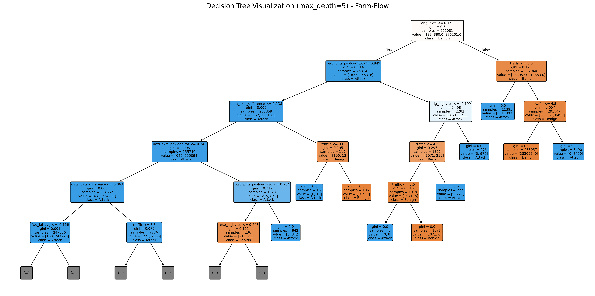
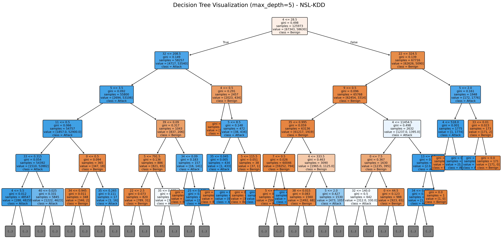
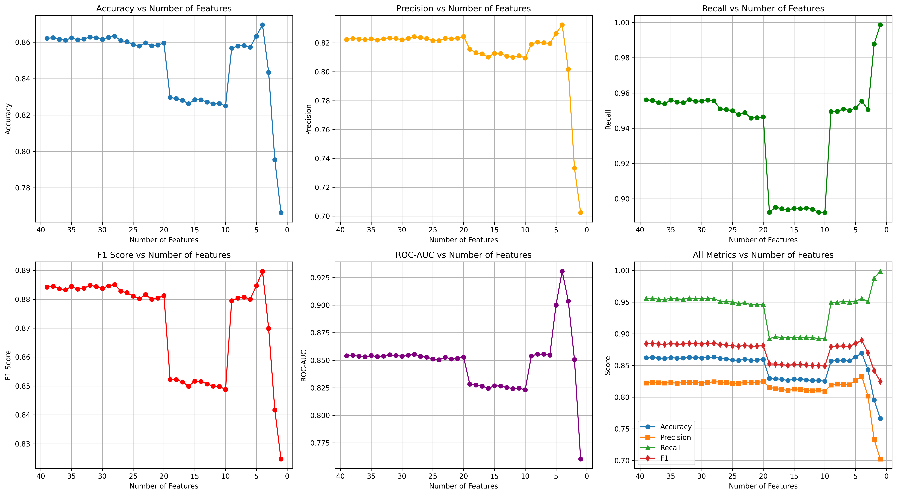
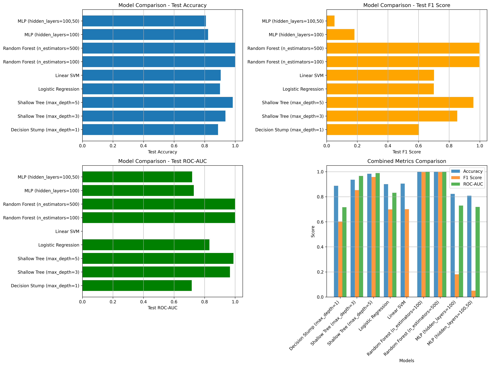
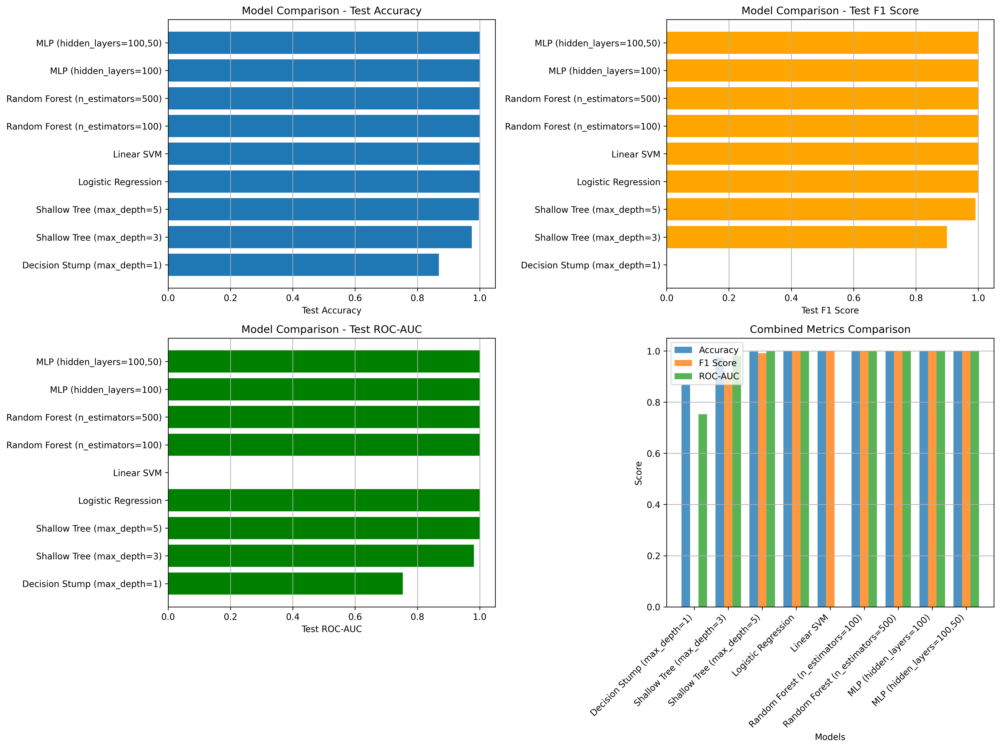
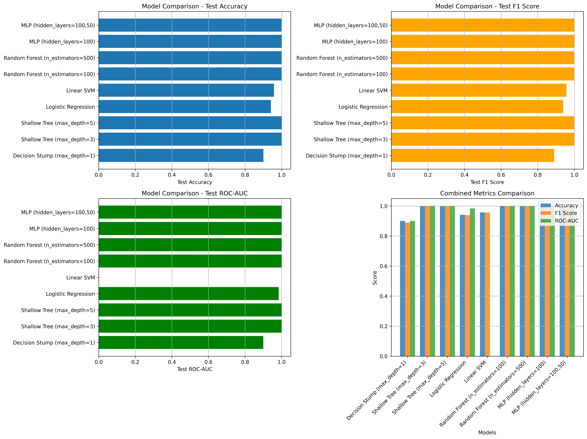
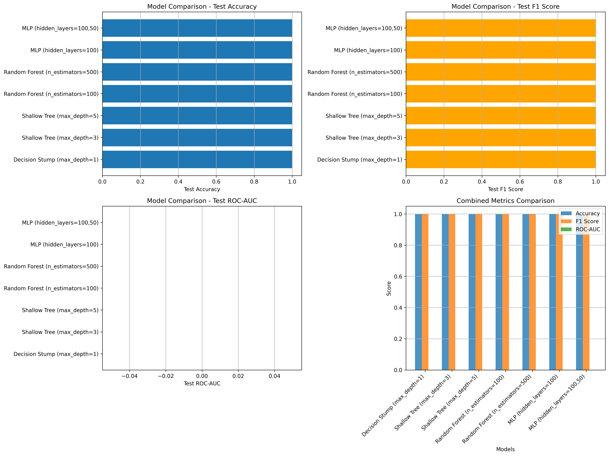
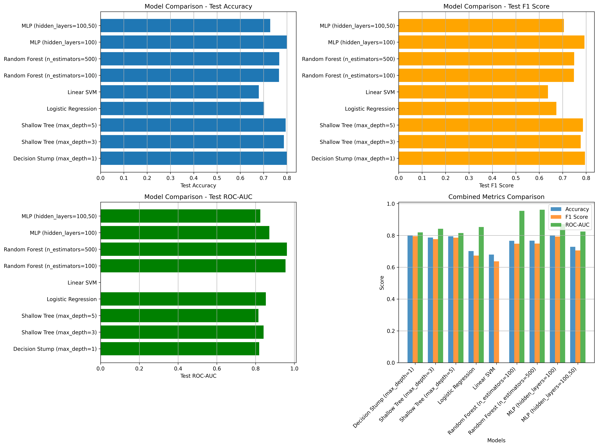
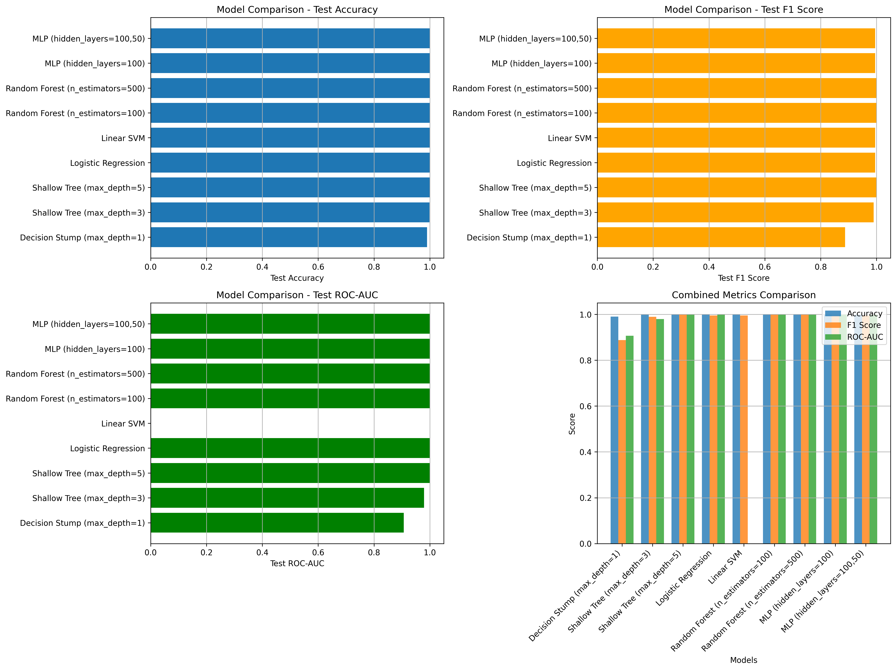
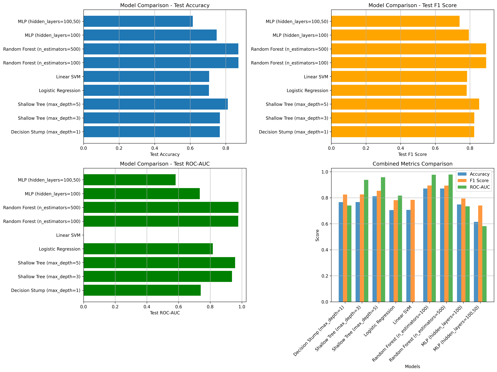

# Decision Tree Experiments - Comprehensive Summary Report

Generated: 2026-01-31 19:46:38

================================================================================

## 1. Main Decision Tree Experiments

### Dataset Information

#### SensorNetGuard IDS

- **Training samples**: 8,000
- **Test samples**: 2,000
- **Features**: 17
- **Training class distribution**: {'0': 7610, '1': 390}
- **Test class distribution**: {'0': 1903, '1': 97}

#### Farm-Flow Binary Classification

- **Training samples**: 561,081
- **Test samples**: 3,545
- **Features**: 26
- **Training class distribution**: {'0': 284880, '1': 276201}
- **Test class distribution**: {'0': 1774, '1': 1771}

#### CIC IDS 2017 Binary Classification

- **Training samples**: 2,264,594
- **Test samples**: 566,149
- **Features**: 70
- **Training class distribution**: {'0': 1818477, '1': 446117}
- **Test class distribution**: {'0': 454620, '1': 111529}

#### UNSW-NB15 Binary Classification

- **Training samples**: 175,341
- **Test samples**: 82,332
- **Features**: 39
- **Training class distribution**: {'1': 119341, '0': 56000}
- **Test class distribution**: {'1': 45332, '0': 37000}

#### NSL-KDD Binary Classification

- **Training samples**: 125,973
- **Test samples**: 22,544
- **Features**: 37
- **Training class distribution**: {'0': 67343, '1': 58630}
- **Test class distribution**: {'1': 12833, '0': 9711}

#### CIC IOV 2024 Binary Classification

- **Training samples**: 1,126,575
- **Test samples**: 281,644
- **Features**: 64
- **Training class distribution**: {'0': 978989, '1': 147586}
- **Test class distribution**: {'0': 244748, '1': 36896}

### Tree Properties

| Dataset | Max Depth | Nodes | Leaves |
|---------|-----------|-------|--------|
| SensorNetGuard | 7 | 23 | 12 |
| Farm-Flow | 9 | 41 | 21 |
| CIC IDS 2017 | 43 | 6,371 | 3,186 |
| UNSW-NB15 | 45 | 11,367 | 5,684 |
| NSL-KDD | 26 | 723 | 362 |
| CIC IOV 2024 | 16 | 73 | 37 |

### Test Set Performance Metrics

| Dataset | Accuracy | Precision | Recall | F1 Score | ROC-AUC | Avg Precision |
|---------|----------|-----------|--------|----------|---------|---------------|
| SensorNetGuard | 0.9995 | 0.9898 | 1.0000 | 0.9949 | 0.9997 | 0.9898 |
| Farm-Flow | 1.0000 | 1.0000 | 1.0000 | 1.0000 | 1.0000 | 1.0000 |
| CIC IDS 2017 | 0.9988 | 0.9969 | 0.9970 | 0.9969 | 0.9985 | 0.9951 |
| UNSW-NB15 | 0.8626 | 0.8230 | 0.9561 | 0.8846 | 0.8546 | 0.8139 |
| NSL-KDD | 0.7790 | 0.9686 | 0.6322 | 0.7651 | 0.8027 | 0.8219 |
| CIC IOV 2024 | 1.0000 | 1.0000 | 0.9999 | 0.9999 | 1.0000 | 1.0000 |

### Decision Tree Visualizations

#### SensorNetGuard


#### Farm-Flow




#### CIC IDS 2017


#### UNSW-NB15


#### NSL-KDD




#### CIC IOV 2024


#### Kyoto


## 2. Decision Stump Experiments (1-Rule Models)

These experiments test model robustness by using only the top feature.


### SensorNetGuard Decision Stump

- **Top Feature**: Error_Rate
- **Feature Importance**: 0.842579
- **Threshold**: 0.158483

**Performance:**

- Test Accuracy: 0.9900
- Test Precision: 0.9753
- Test Recall: 0.8144
- Test F1: 0.8876
- Test ROC-AUC: 0.9067

**Noise Impact Analysis (Perturbation Study):**


**Performance vs Noise Level:**

| Noise Level (std) | Accuracy | Precision | Recall | F1 Score |
|-------------------|----------|-----------|--------|----------|
| 0.00 | 0.9900 | 0.9753 | 0.8144 | 0.8876 |
| 0.01 | 0.9900 | 0.9639 | 0.8247 | 0.8889 |
| 0.05 | 0.9900 | 0.9639 | 0.8247 | 0.8889 |
| 0.10 | 0.9905 | 0.9643 | 0.8351 | 0.8950 |
| 0.20 | 0.9880 | 0.9294 | 0.8144 | 0.8681 |
| 0.50 | 0.9780 | 0.7573 | 0.8041 | 0.7800 |
| 1.00 | 0.9305 | 0.3871 | 0.7423 | 0.5088 |
| 2.00 | 0.8105 | 0.1643 | 0.7113 | 0.2669 |
| 5.00 | 0.6430 | 0.0870 | 0.6701 | 0.1540 |

**Cross-Validation (5-fold):**

- Mean Accuracy: 0.9920 (±0.0021)
- Mean F1: 0.9131 (±0.0259)

### Farm-Flow Decision Stump

- **Top Feature**: orig_pkts
- **Feature Importance**: 0.854616
- **Threshold**: 0.168970

**Performance:**

- Test Accuracy: 0.9001
- Test Precision: 0.9937
- Test Recall: 0.8052
- Test F1: 0.8896
- Test ROC-AUC: 0.9001

**Noise Impact Analysis (Perturbation Study):**


**Performance vs Noise Level:**

| Noise Level (std) | Accuracy | Precision | Recall | F1 Score |
|-------------------|----------|-----------|--------|----------|
| 0.00 | 0.9001 | 0.9937 | 0.8052 | 0.8896 |
| 0.01 | 0.9001 | 0.9937 | 0.8052 | 0.8896 |
| 0.05 | 0.9001 | 0.9937 | 0.8052 | 0.8896 |
| 0.10 | 0.9001 | 0.9937 | 0.8052 | 0.8896 |
| 0.20 | 0.8841 | 0.9795 | 0.7843 | 0.8711 |
| 0.50 | 0.7704 | 0.8500 | 0.6561 | 0.7406 |
| 1.00 | 0.6804 | 0.7359 | 0.5618 | 0.6372 |
| 2.00 | 0.6051 | 0.6264 | 0.5189 | 0.5676 |
| 5.00 | 0.5413 | 0.5447 | 0.4986 | 0.5206 |

**Cross-Validation (5-fold):**

- Mean Accuracy: 0.9613 (±0.0004)
- Mean F1: 0.9594 (±0.0004)

## 3. Depth-Limited Experiments (max_depth=10)

Comparison of unlimited depth vs max_depth=10 for datasets with trees > 10 depth.


### CIC IDS 2017

Comparison of unlimited depth vs max_depth=10:


| Metric | Unlimited Depth | max_depth=10 | Difference |
|--------|-----------------|--------------|------------|
| Accuracy | 0.9988 | 0.9968 | +0.0019 |
| Precision | 0.9969 | 0.9950 | +0.0019 |
| Recall | 0.9970 | 0.9890 | +0.0080 |
| F1_score | 0.9969 | 0.9920 | +0.0050 |
| Roc_auc | 0.9985 | 0.9958 | +0.0027 |

### CIC IOV 2024

Comparison of unlimited depth vs max_depth=10:


| Metric | Unlimited Depth | max_depth=10 | Difference |
|--------|-----------------|--------------|------------|
| Accuracy | 1.0000 | 1.0000 | +0.0000 |
| Precision | 1.0000 | 1.0000 | +0.0000 |
| Recall | 0.9999 | 0.9999 | +0.0000 |
| F1_score | 0.9999 | 0.9999 | +0.0000 |
| Roc_auc | 1.0000 | 1.0000 | +0.0000 |

### NSL-KDD

Comparison of unlimited depth vs max_depth=10:


| Metric | Unlimited Depth | max_depth=10 | Difference |
|--------|-----------------|--------------|------------|
| Accuracy | 0.7790 | 0.7875 | -0.0085 |
| Precision | 0.9686 | 0.9705 | -0.0019 |
| Recall | 0.6322 | 0.6463 | -0.0141 |
| F1_score | 0.7651 | 0.7759 | -0.0108 |
| Roc_auc | 0.8027 | 0.7469 | +0.0558 |

### UNSW-NB15

Comparison of unlimited depth vs max_depth=10:


| Metric | Unlimited Depth | max_depth=10 | Difference |
|--------|-----------------|--------------|------------|
| Accuracy | 0.8626 | 0.8794 | -0.0168 |
| Precision | 0.8230 | 0.8394 | -0.0164 |
| Recall | 0.9561 | 0.9658 | -0.0097 |
| F1_score | 0.8846 | 0.8982 | -0.0136 |
| Roc_auc | 0.8546 | 0.9735 | -0.1190 |

## 4. Feature Ablation Experiments

These experiments show how performance changes as features are removed, starting from lowest importance.


### CIC IDS 2017

- **Max Features Tested**: 78
- **Min Features Tested**: 3
- **Best Accuracy**: 0.9991
- **Best F1 Score**: 0.9976
- **Best ROC-AUC**: 0.9995

**Performance vs Number of Features:**

| Features | Accuracy | Precision | Recall | F1 Score | ROC-AUC |
|----------|----------|-----------|--------|----------|---------|
| 78 | 0.9988 | 0.9969 | 0.9970 | 0.9969 | 0.9985 |
| 75 | 0.9988 | 0.9969 | 0.9969 | 0.9969 | 0.9985 |
| 72 | 0.9988 | 0.9968 | 0.9969 | 0.9969 | 0.9985 |
| 69 | 0.9988 | 0.9968 | 0.9970 | 0.9969 | 0.9985 |
| 66 | 0.9988 | 0.9969 | 0.9970 | 0.9969 | 0.9985 |
| 63 | 0.9988 | 0.9968 | 0.9969 | 0.9969 | 0.9985 |
| 60 | 0.9988 | 0.9969 | 0.9970 | 0.9969 | 0.9985 |
| 57 | 0.9988 | 0.9969 | 0.9970 | 0.9969 | 0.9985 |
| 54 | 0.9988 | 0.9969 | 0.9970 | 0.9969 | 0.9985 |
| 51 | 0.9988 | 0.9969 | 0.9971 | 0.9970 | 0.9985 |
| 48 | 0.9988 | 0.9969 | 0.9970 | 0.9969 | 0.9985 |
| 45 | 0.9988 | 0.9968 | 0.9970 | 0.9969 | 0.9985 |
| 42 | 0.9988 | 0.9969 | 0.9970 | 0.9969 | 0.9985 |
| 39 | 0.9988 | 0.9969 | 0.9970 | 0.9970 | 0.9985 |
| 36 | 0.9988 | 0.9970 | 0.9970 | 0.9970 | 0.9986 |
| 33 | 0.9988 | 0.9970 | 0.9970 | 0.9970 | 0.9985 |
| 30 | 0.9988 | 0.9968 | 0.9969 | 0.9969 | 0.9985 |
| 27 | 0.9988 | 0.9968 | 0.9968 | 0.9968 | 0.9984 |
| 24 | 0.9988 | 0.9969 | 0.9969 | 0.9969 | 0.9985 |
| 21 | 0.9987 | 0.9967 | 0.9969 | 0.9968 | 0.9984 |
| 18 | 0.9988 | 0.9969 | 0.9970 | 0.9969 | 0.9985 |
| 15 | 0.9988 | 0.9969 | 0.9970 | 0.9970 | 0.9985 |
| 12 | 0.9991 | 0.9968 | 0.9985 | 0.9976 | 0.9990 |
| 9 | 0.9983 | 0.9967 | 0.9948 | 0.9958 | 0.9995 |
| 6 | 0.9979 | 0.9955 | 0.9937 | 0.9946 | 0.9994 |
| 3 | 0.9689 | 0.9928 | 0.8483 | 0.9149 | 0.9952 |


### Farm-Flow

- **Max Features Tested**: 30
- **Min Features Tested**: 1
- **Best Accuracy**: 1.0000
- **Best F1 Score**: 1.0000
- **Best ROC-AUC**: 1.0000

**Performance vs Number of Features:**

| Features | Accuracy | Precision | Recall | F1 Score | ROC-AUC |
|----------|----------|-----------|--------|----------|---------|
| 30 | 1.0000 | 1.0000 | 1.0000 | 1.0000 | 1.0000 |
| 28 | 1.0000 | 1.0000 | 1.0000 | 1.0000 | 1.0000 |
| 26 | 1.0000 | 1.0000 | 1.0000 | 1.0000 | 1.0000 |
| 24 | 1.0000 | 1.0000 | 1.0000 | 1.0000 | 1.0000 |
| 22 | 1.0000 | 1.0000 | 1.0000 | 1.0000 | 1.0000 |
| 20 | 1.0000 | 1.0000 | 1.0000 | 1.0000 | 1.0000 |
| 18 | 1.0000 | 1.0000 | 1.0000 | 1.0000 | 1.0000 |
| 16 | 1.0000 | 1.0000 | 1.0000 | 1.0000 | 1.0000 |
| 14 | 1.0000 | 1.0000 | 1.0000 | 1.0000 | 1.0000 |
| 12 | 1.0000 | 1.0000 | 1.0000 | 1.0000 | 1.0000 |
| 10 | 1.0000 | 1.0000 | 1.0000 | 1.0000 | 1.0000 |
| 8 | 1.0000 | 1.0000 | 1.0000 | 1.0000 | 1.0000 |
| 6 | 1.0000 | 1.0000 | 1.0000 | 1.0000 | 1.0000 |
| 4 | 1.0000 | 1.0000 | 1.0000 | 1.0000 | 1.0000 |
| 2 | 1.0000 | 1.0000 | 1.0000 | 1.0000 | 1.0000 |
| 1 | 0.9049 | 0.9838 | 0.8233 | 0.8964 | 0.9129 |


### SensorNetGuard

- **Max Features Tested**: 17
- **Min Features Tested**: 1
- **Best Accuracy**: 1.0000
- **Best F1 Score**: 1.0000
- **Best ROC-AUC**: 1.0000

**Performance vs Number of Features:**

| Features | Accuracy | Precision | Recall | F1 Score | ROC-AUC |
|----------|----------|-----------|--------|----------|---------|
| 17 | 0.9995 | 0.9898 | 1.0000 | 0.9949 | 0.9997 |
| 16 | 1.0000 | 1.0000 | 1.0000 | 1.0000 | 1.0000 |
| 15 | 1.0000 | 1.0000 | 1.0000 | 1.0000 | 1.0000 |
| 14 | 0.9990 | 1.0000 | 0.9794 | 0.9896 | 0.9897 |
| 13 | 0.9990 | 1.0000 | 0.9794 | 0.9896 | 0.9897 |
| 12 | 0.9990 | 0.9798 | 1.0000 | 0.9898 | 0.9995 |
| 11 | 0.9995 | 0.9898 | 1.0000 | 0.9949 | 0.9997 |
| 10 | 0.9990 | 0.9798 | 1.0000 | 0.9898 | 0.9995 |
| 9 | 1.0000 | 1.0000 | 1.0000 | 1.0000 | 1.0000 |
| 8 | 0.9985 | 0.9896 | 0.9794 | 0.9845 | 0.9894 |
| 7 | 1.0000 | 1.0000 | 1.0000 | 1.0000 | 1.0000 |
| 6 | 1.0000 | 1.0000 | 1.0000 | 1.0000 | 1.0000 |
| 5 | 1.0000 | 1.0000 | 1.0000 | 1.0000 | 1.0000 |
| 4 | 1.0000 | 1.0000 | 1.0000 | 1.0000 | 1.0000 |
| 3 | 0.9995 | 0.9898 | 1.0000 | 0.9949 | 0.9997 |
| 2 | 0.9970 | 0.9596 | 0.9794 | 0.9694 | 0.9886 |
| 1 | 0.9835 | 0.8478 | 0.8041 | 0.8254 | 0.8984 |


### UNSW-NB15

- **Max Features Tested**: 39
- **Min Features Tested**: 1
- **Best Accuracy**: 0.8695
- **Best F1 Score**: 0.8897
- **Best ROC-AUC**: 0.9308

**Performance vs Number of Features:**

| Features | Accuracy | Precision | Recall | F1 Score | ROC-AUC |
|----------|----------|-----------|--------|----------|---------|
| 39 | 0.8621 | 0.8224 | 0.9561 | 0.8842 | 0.8541 |
| 37 | 0.8616 | 0.8226 | 0.9544 | 0.8836 | 0.8535 |
| 35 | 0.8624 | 0.8228 | 0.9560 | 0.8844 | 0.8542 |
| 33 | 0.8618 | 0.8228 | 0.9545 | 0.8838 | 0.8537 |
| 31 | 0.8624 | 0.8232 | 0.9554 | 0.8844 | 0.8543 |
| 29 | 0.8627 | 0.8231 | 0.9560 | 0.8846 | 0.8546 |
| 27 | 0.8609 | 0.8237 | 0.9510 | 0.8828 | 0.8536 |
| 25 | 0.8588 | 0.8215 | 0.9499 | 0.8810 | 0.8511 |
| 23 | 0.8596 | 0.8232 | 0.9489 | 0.8816 | 0.8527 |
| 21 | 0.8585 | 0.8233 | 0.9460 | 0.8804 | 0.8516 |
| 19 | 0.8297 | 0.8156 | 0.8923 | 0.8523 | 0.8283 |
| 17 | 0.8281 | 0.8124 | 0.8943 | 0.8514 | 0.8265 |
| 15 | 0.8285 | 0.8128 | 0.8944 | 0.8517 | 0.8267 |
| 13 | 0.8271 | 0.8108 | 0.8947 | 0.8507 | 0.8253 |
| 11 | 0.8263 | 0.8112 | 0.8923 | 0.8498 | 0.8246 |
| 9 | 0.8567 | 0.8191 | 0.9494 | 0.8795 | 0.8539 |
| 7 | 0.8582 | 0.8202 | 0.9509 | 0.8807 | 0.8555 |
| 5 | 0.8634 | 0.8266 | 0.9515 | 0.8846 | 0.9001 |
| 3 | 0.8434 | 0.8018 | 0.9506 | 0.8699 | 0.9037 |
| 1 | 0.7663 | 0.7024 | 0.9986 | 0.8247 | 0.7603 |




## 5. Comprehensive Model Comparison

Comparison of baseline models (decision stumps, shallow trees) against ensemble methods (Random Forest, XGBoost) and neural networks (MLP), plus linear models (Logistic Regression, Linear SVM).


### CIC IDS 2017

| Model | Test Accuracy | Test Precision | Test Recall | Test F1 | Test ROC-AUC |
|-------|---------------|-----------------|-------------|---------|--------------|
| Random Forest (n_estimators=500) | 0.9989 | 0.9972 | 0.9972 | 0.9972 | 0.9998 |
| Random Forest (n_estimators=100) | 0.9989 | 0.9972 | 0.9971 | 0.9972 | 0.9998 |
| Shallow Tree (max_depth=5) | 0.9835 | 0.9506 | 0.9663 | 0.9584 | 0.9890 |
| Shallow Tree (max_depth=3) | 0.9356 | 0.7756 | 0.9475 | 0.8529 | 0.9661 |
| Linear SVM | 0.9046 | 0.9158 | 0.5680 | 0.7011 | 0.0000 |
| Logistic Regression | 0.9005 | 0.8633 | 0.5880 | 0.6995 | 0.8320 |
| Decision Stump (max_depth=1) | 0.8875 | 0.9892 | 0.4334 | 0.6028 | 0.7161 |
| MLP (hidden_layers=100) | 0.8226 | 0.9988 | 0.0995 | 0.1809 | 0.7294 |
| MLP (hidden_layers=100,50) | 0.8080 | 0.9768 | 0.0261 | 0.0508 | 0.7186 |




### CIC IOV 2024

| Model | Test Accuracy | Test Precision | Test Recall | Test F1 | Test ROC-AUC |
|-------|---------------|-----------------|-------------|---------|--------------|
| Logistic Regression | 1.0000 | 1.0000 | 0.9999 | 0.9999 | 1.0000 |
| Linear SVM | 1.0000 | 1.0000 | 0.9999 | 0.9999 | 0.0000 |
| Random Forest (n_estimators=100) | 1.0000 | 1.0000 | 0.9999 | 0.9999 | 1.0000 |
| Random Forest (n_estimators=500) | 1.0000 | 1.0000 | 0.9999 | 0.9999 | 1.0000 |
| MLP (hidden_layers=100) | 1.0000 | 1.0000 | 0.9999 | 0.9999 | 1.0000 |
| MLP (hidden_layers=100,50) | 1.0000 | 1.0000 | 0.9999 | 0.9999 | 1.0000 |
| Shallow Tree (max_depth=5) | 0.9975 | 0.9817 | 0.9999 | 0.9907 | 0.9996 |
| Shallow Tree (max_depth=3) | 0.9744 | 0.9220 | 0.8786 | 0.8998 | 0.9814 |
| Decision Stump (max_depth=1) | 0.8690 | 0.0000 | 0.0000 | 0.0000 | 0.7529 |




### Farm-Flow

| Model | Test Accuracy | Test Precision | Test Recall | Test F1 | Test ROC-AUC |
|-------|---------------|-----------------|-------------|---------|--------------|
| Shallow Tree (max_depth=5) | 0.9994 | 0.9989 | 1.0000 | 0.9994 | 0.9995 |
| MLP (hidden_layers=100) | 0.9994 | 0.9989 | 1.0000 | 0.9994 | 0.9998 |
| Shallow Tree (max_depth=3) | 0.9992 | 0.9989 | 0.9994 | 0.9992 | 0.9995 |
| MLP (hidden_layers=100,50) | 0.9992 | 0.9989 | 0.9994 | 0.9992 | 0.9998 |
| Random Forest (n_estimators=100) | 0.9989 | 0.9977 | 1.0000 | 0.9989 | 1.0000 |
| Random Forest (n_estimators=500) | 0.9989 | 0.9977 | 1.0000 | 0.9989 | 1.0000 |
| Linear SVM | 0.9577 | 0.9810 | 0.9334 | 0.9566 | 0.0000 |
| Logistic Regression | 0.9410 | 0.9791 | 0.9012 | 0.9385 | 0.9838 |
| Decision Stump (max_depth=1) | 0.9001 | 0.9937 | 0.8052 | 0.8896 | 0.9001 |




### Kyoto

| Model | Test Accuracy | Test Precision | Test Recall | Test F1 | Test ROC-AUC |
|-------|---------------|-----------------|-------------|---------|--------------|
| Decision Stump (max_depth=1) | 1.0000 | 1.0000 | 1.0000 | 1.0000 | 0.0000 |
| Shallow Tree (max_depth=3) | 1.0000 | 1.0000 | 1.0000 | 1.0000 | 0.0000 |
| Shallow Tree (max_depth=5) | 1.0000 | 1.0000 | 1.0000 | 1.0000 | 0.0000 |
| Random Forest (n_estimators=100) | 1.0000 | 1.0000 | 1.0000 | 1.0000 | 0.0000 |
| Random Forest (n_estimators=500) | 1.0000 | 1.0000 | 1.0000 | 1.0000 | 0.0000 |
| MLP (hidden_layers=100) | 1.0000 | 1.0000 | 1.0000 | 1.0000 | 0.0000 |
| MLP (hidden_layers=100,50) | 1.0000 | 1.0000 | 1.0000 | 1.0000 | 0.0000 |




### NSL-KDD

| Model | Test Accuracy | Test Precision | Test Recall | Test F1 | Test ROC-AUC |
|-------|---------------|-----------------|-------------|---------|--------------|
| Decision Stump (max_depth=1) | 0.7999 | 0.9522 | 0.6827 | 0.7952 | 0.8187 |
| MLP (hidden_layers=100) | 0.7995 | 0.9617 | 0.6747 | 0.7930 | 0.8713 |
| Shallow Tree (max_depth=5) | 0.7944 | 0.9630 | 0.6644 | 0.7863 | 0.8149 |
| Shallow Tree (max_depth=3) | 0.7869 | 0.9621 | 0.6514 | 0.7768 | 0.8415 |
| Random Forest (n_estimators=500) | 0.7670 | 0.9681 | 0.6108 | 0.7491 | 0.9615 |
| Random Forest (n_estimators=100) | 0.7662 | 0.9684 | 0.6092 | 0.7479 | 0.9545 |
| MLP (hidden_layers=100,50) | 0.7282 | 0.9210 | 0.5716 | 0.7054 | 0.8247 |
| Logistic Regression | 0.7020 | 0.8965 | 0.5387 | 0.6730 | 0.8529 |
| Linear SVM | 0.6793 | 0.8950 | 0.4947 | 0.6372 | 0.0000 |




### SensorNetGuard

| Model | Test Accuracy | Test Precision | Test Recall | Test F1 | Test ROC-AUC |
|-------|---------------|-----------------|-------------|---------|--------------|
| Shallow Tree (max_depth=5) | 1.0000 | 1.0000 | 1.0000 | 1.0000 | 1.0000 |
| Random Forest (n_estimators=100) | 1.0000 | 1.0000 | 1.0000 | 1.0000 | 1.0000 |
| Random Forest (n_estimators=500) | 1.0000 | 1.0000 | 1.0000 | 1.0000 | 1.0000 |
| Logistic Regression | 0.9995 | 1.0000 | 0.9897 | 0.9948 | 1.0000 |
| Linear SVM | 0.9995 | 1.0000 | 0.9897 | 0.9948 | 0.0000 |
| MLP (hidden_layers=100) | 0.9995 | 1.0000 | 0.9897 | 0.9948 | 1.0000 |
| MLP (hidden_layers=100,50) | 0.9995 | 1.0000 | 0.9897 | 0.9948 | 1.0000 |
| Shallow Tree (max_depth=3) | 0.9990 | 1.0000 | 0.9794 | 0.9896 | 0.9794 |
| Decision Stump (max_depth=1) | 0.9900 | 0.9753 | 0.8144 | 0.8876 | 0.9067 |




### UNSW-NB15

| Model | Test Accuracy | Test Precision | Test Recall | Test F1 | Test ROC-AUC |
|-------|---------------|-----------------|-------------|---------|--------------|
| Random Forest (n_estimators=100) | 0.8714 | 0.8179 | 0.9858 | 0.8941 | 0.9772 |
| Random Forest (n_estimators=500) | 0.8707 | 0.8169 | 0.9861 | 0.8936 | 0.9784 |
| Shallow Tree (max_depth=5) | 0.8119 | 0.7474 | 0.9945 | 0.8534 | 0.9575 |
| Shallow Tree (max_depth=3) | 0.7670 | 0.7027 | 1.0000 | 0.8254 | 0.9379 |
| Decision Stump (max_depth=1) | 0.7663 | 0.7024 | 0.9987 | 0.8248 | 0.7402 |
| MLP (hidden_layers=100) | 0.7488 | 0.7236 | 0.8799 | 0.7941 | 0.7343 |
| Linear SVM | 0.7065 | 0.6592 | 0.9666 | 0.7839 | 0.0000 |
| Logistic Regression | 0.7053 | 0.6607 | 0.9550 | 0.7811 | 0.8168 |
| MLP (hidden_layers=100,50) | 0.6149 | 0.5885 | 0.9989 | 0.7407 | 0.5813 |




## 6. Top 10 Most Important Features (by Dataset)

### SensorNetGuard

1. **Error_Rate**: 0.842579
2. **Energy_Consumption_Rate**: 0.099186
3. **Data_Throughput**: 0.028865
4. **Packet_Drop_Rate**: 0.013451
5. **Data_Transmission_Frequency**: 0.008375
6. **Route_Request_Frequency**: 0.005748
7. **CPU_Usage**: 0.001797
8. **Packet_Rate**: 0.000000
9. **Memory_Usage**: 0.000000
10. **Data_Reception_Frequency**: 0.000000

### Farm-Flow

1. **orig_pkts**: 0.854616
2. **traffic**: 0.135517
3. **bwd_pkts_payload.tot**: 0.003808
4. **orig_ip_bytes**: 0.002891
5. **bwd_pkts_payload.avg**: 0.001091
6. **fwd_pkts_per_sec**: 0.000868
7. **data_pkts_difference**: 0.000737
8. **resp_ip_bytes**: 0.000455
9. **fwd_iat.avg**: 0.000017
10. **pkts_difference**: 0.000000

### CIC IDS 2017

1. **Bwd Packet Length Std**: 0.376439
2. **Average Packet Size**: 0.190235
3. **Bwd Header Length**: 0.132385
4. **Destination Port**: 0.105153
5. **Max Packet Length**: 0.092386
6. **Init_Win_bytes_forward**: 0.026966
7. **min_seg_size_forward**: 0.018668
8. **Fwd Packet Length Std**: 0.009499
9. **Init_Win_bytes_backward**: 0.007101
10. **Fwd IAT Min**: 0.005157

### UNSW-NB15

1. **sttl**: 0.675291
2. **ct_srv_dst**: 0.062550
3. **sbytes**: 0.045731
4. **smean**: 0.031848
5. **ct_srv_src**: 0.012004
6. **sload**: 0.011506
7. **sloss**: 0.011187
8. **tcprtt**: 0.011011
9. **sinpkt**: 0.010228
10. **ct_dst_src_ltm**: 0.010166

### NSL-KDD

1. **4**: 0.753417
2. **32**: 0.052207
3. **22**: 0.048184
4. **5**: 0.033619
5. **40**: 0.025502
6. **9**: 0.020302
7. **35**: 0.014645
8. **11**: 0.010112
9. **23**: 0.009484
10. **33**: 0.008925

### CIC IOV 2024

1. **DATA_310**: 0.444259
2. **DATA_316**: 0.145283
3. **DATA_710**: 0.126105
4. **DATA_116**: 0.063092
5. **DATA_016**: 0.055330
6. **DATA_713**: 0.047556
7. **DATA_415**: 0.046577
8. **DATA_613**: 0.040625
9. **DATA_615**: 0.008791
10. **DATA_411**: 0.008017

## 7. Confusion Matrices (Test Set)

### SensorNetGuard

```
                Predicted
              Benign  Attack
Actual Benign    1902       1
       Attack       0      97
```

### Farm-Flow

```
                Predicted
              Benign  Attack
Actual Benign    1774       0
       Attack       0    1771
```

### CIC IDS 2017

```
                Predicted
              Benign  Attack
Actual Benign   454271     349
       Attack     339   111190
```

### UNSW-NB15

```
                Predicted
              Benign  Attack
Actual Benign   27680    9320
       Attack    1990   43342
```

### NSL-KDD

```
                Predicted
              Benign  Attack
Actual Benign    9448     263
       Attack    4720    8113
```

### CIC IOV 2024

```
                Predicted
              Benign  Attack
Actual Benign   244748       0
       Attack       5   36891
```
